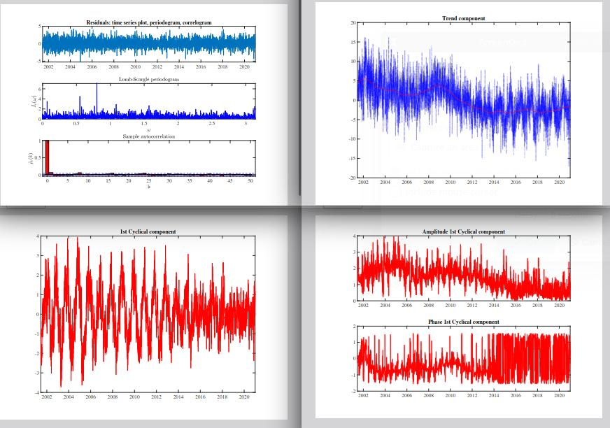

# The fractional Sinusoidal Waveform process (fSWp)

The fSWp models periodical time series considering that the periodicity and trend evolve stochastically according to possibly nonstationary long memory proccesses. It is estimated by inear state space methods (Kalman Filter).

This repository contains packages of MATLAB functions that can be used to fit various time series with seasonal signals occuring within a geodetic context: 
* vertical displacement time series from the Global Navigation Satellite Systems (DTS), 
* Non Tidal Atmospheric Loading time series (NTAL), 
* hydrological mass loading (HYDL), 
* precipitable water vapor (PWV) time series, 
* raw GNSS observations from the tenv format

## Installation

Each folder contains a main which name starts always with "sAPplication". 
Time series corresponding to the model are saved in ".txt format and can be found in each folder.

Steps for running the software:
$ In the sAPplication file: change the name of the time series file you want to fit as follows: 
"structData = readtable(['nameofthefile.txt']);"
$ Press run
$ Figures and various goodness of fit indicator are output

### Prerequisites

You will need MATLAB, versions 2022a with the optimization toolbox

* For the use of the HYDL toolbox we recommand following processor and ram: 11th Gen Intel(R) Core(TM) i7-1185G7 @ 3.00GHz   3.00 GH to get optimal results
and 32GB of ram

## Usage

### Toolboxes

Each time series can be modelled as: Trend + noise + a*cos(\omega t) + a'*sin(\omega t) 
where a and a' are the amplitudes of the periodical signals with angular frequency \omega and can be deterministic (constant) or stochastic (time varying)

You will find 6 toolboxes:
* IGS_forfSW_DETERM_TREND_plus_AR1_model1
* NTAL_forfSW_DETERM_TREND_plus_ARMA11_model2
* PWV_Pangea_DETERM_TREND_plus_AR1_model1
* HYDL_forFSW_RW_TREND_model4
* LPAL_forFSW_RW_TREND_model4
* AllDeterministic_model5

### Models and time series

They correspond to the following models:

|   | **Model 1** | **Model 2** | **Model 3** |**Model 4** |**Model 5** |
| ------------- | ------------- | ------------- | ------------- |------------- | ------------- |
|**Trend** |  deterministic |deterministic|local level stochastic|stochastic|deterministic
|**Noise (linear component)**   |  AR(1) |ARMA(1,1) |AR(1) |irrelevant |AR(1) |
|**Noise (periodical component)**  | stochastic fSW  |stochastic fSW  |stochastic fSW  |stochastic fSW  |deterministic  |
|**Example**   |  IGS DTS | NTAL | tenv format | HYDL, LPAL station | xx |

$ For model 1, 2 and 4 we have used the time series from the International GPS Service (IGS) station DRAO (USA), as well as NEAH and LPAL (strong periodical components)

$ For model 3, we have used examples from Wettzell, Germany with in total 6 GPS stations (WTZA, WTZJ, WTZR, WTZS, WTZZ and WTZL). The observations are in raw format and contains outliers, data gaps and jumps. A description of the tenv format can be found in the folder under tenv format.txt. 
$ All time series are freely availabe to download for testing purpose under

		NTAL: http://rz-vm115.gfz-potsdam.de:8080/repository/entry/show?entryid=80daee1b-
			ff73-481f-b0f3-18026282c03e
			
		HYDL:  http://geodesy.unr.edu/NGLStationPages/GlobalStationList
		
		PWV: https://doi.pangaea.de/10.1594/PANGAEA.862525
		
		IGS GPS: http://geodesy.unr.edu/NGLStationPages/GlobalStationList

### Add-on

$ Additionally, we provide a set of functions to generate fSWp and fractional noise in the folder "SimulationsFN&fSW". The main file is called "sSimulations.m". Parameters can be changed to generate a fractional noise or a fSWp. They are described in the file "sSimulations.m".

Note:
*  We have chosen time series with yearly and semi-yearly periodical components. Depending on your context, the frequencies can be changed:
vPeriod  = [365.25] -> for yearly component ;
dLambda  = (2*pi./vPeriod)*(1:harm); -> harm=2 for semi- and yearly components

* Please avoid changing mX in the main file
* For fitting other time series with similar functional model, you can change the MATLAB files starting with "fgrid_InitConds". Please contact us for support 

## Output

Following figures are output:
Residual diagnostics (periodogram, autocorrelation), original time series with trend, additional noise on the linear component, amplitude and phase of the periodical components, periodical components.
They are automatically saved as .pdf in the folder

We provide a file called "diagnostic.m" which output:
$ the AIC, the BIC, the likelihood, the Sum2Corr (sum of square of the sample autocorrelation of the residuals), value of the trend (not relevant for model 3), uncertainty of the trend (from the AR(1), usual formulation in geodesy, see references below) and from the KF

$ run the lines from the quantities you wish to output

## Additional Documentation & Acknowledgments

* The cases treated in the available toolboxes are described in:
.... arXiv to come

* You will find further information on the fSWp and the theory at:
Proietti, T., & Maddanu, F.(2022). Modelling cycles in climate series: The fractional sinusoidal waveform process. Modeling Cycles In Climate Series. Journal of Econometrics. https://doi.org/10.1016/j.jeconom.2022.04.008

* For geodetic example, please refer to: 
Davis, J. L., Wernicke, B. P., and Tamisiea, M. E. (2012), On seasonal signals in geodetic time series, J. Geophys. Res., 117, B01403, doi:10.1029/2011JB008690.
Klos, A., Bos, M.S. & Bogusz, J. Detecting time-varying seasonal signal in GPS position time series with different noise levels. GPS Solut 22, 21 (2018). https://doi.org/10.1007/s10291-017-0686-6

This study is supported by the Deutsche Forschungsgemein-
schaft under the project KE2453/2-1
